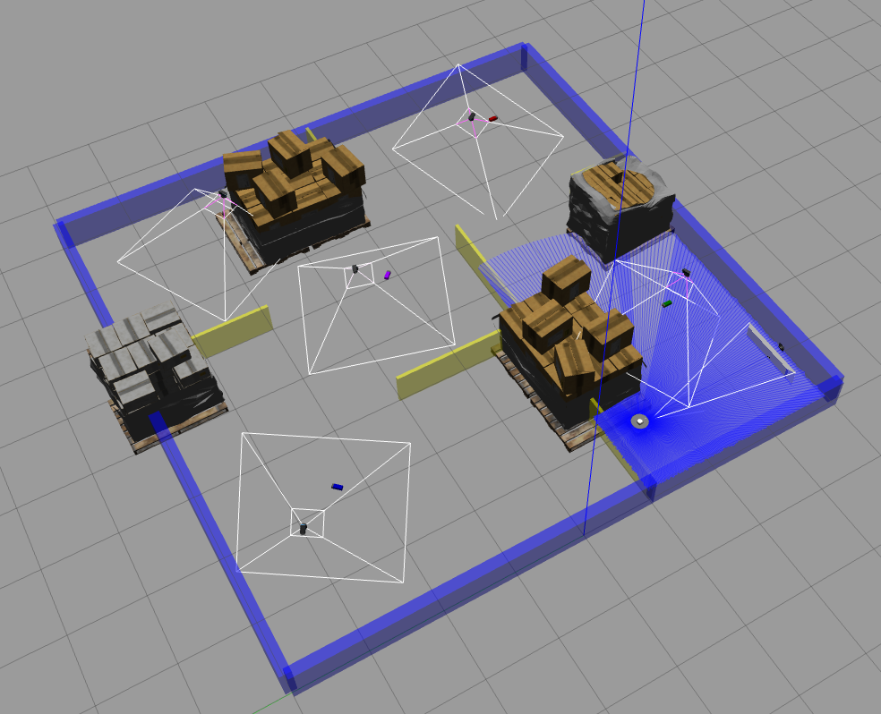

# WAYPOINT NAVIGATION USING TURTLEBOT3



## Software Requirements
```
Ubuntu 20.04
ROS Galactic
Gazebo11
Turtlebot3_Simulation package
RViz
```
### Running the code
1. *Clone the package to your ros workspace*
2. *Make sure all the dependencies are installed*
```
rosdep update
rosdep install --from-paths src -y --ignore-src
```
3. *Build and source the workspace*
```
cd <path to your ros_ws>/colcon build
source install/setup.bash
```
4. *To edit the pattern of the waypoints*
```
cd <path to your package>/group13_final code .
```
*and edit config/waypoints.params.yaml file*

5. *Launch turtlebot3 in the maze world with RViz using*
```
ros2 launch final_project final_project.launch.py 
```
6. *Run the broadcaster for broadcasting the battery poses using*
```
ros2 run group13_final broadcaster_demo --ros-args --remap use_sim_time:=True
```
7. *Launch the navigation node for maze navigation using*
```
ros2 launch group13_final load_param.py
```
